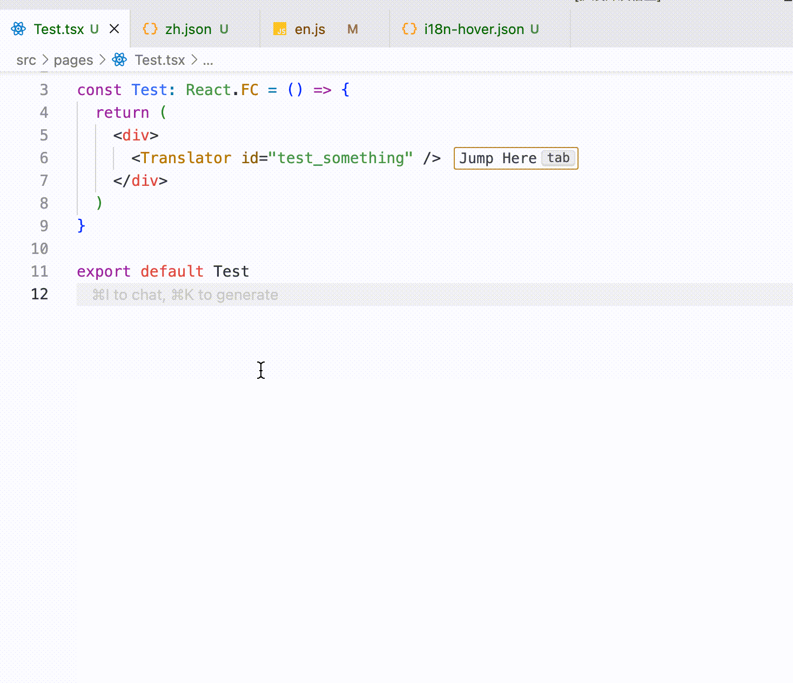

# i18n-hover desc

international hover tips plugin

## features

- hover on a string, it will show the translation of the string.
- support multiple languages.
- support click to visit the translation file.
- support display missing translations.

## usage

English
- default no configuration, use it directly.
- if you need to configure it, you can configure it in `.vscode/i18n-hover.json`.

```json
{
  "localeDir": "src/locales",
  "defaultJumpLocale": "en"
}
```

## interface

```ts
interface I18nHoverConfig {
  /** locale relative path */
  localeDir: string;
  /** default jump to */
  defaultJumpLocale: string;
}
```

## attention

English
- the language name should be consistent with the file name, for example: en.js or en.json
- support json and js files
- support any language name (en can, english can)

## preview

